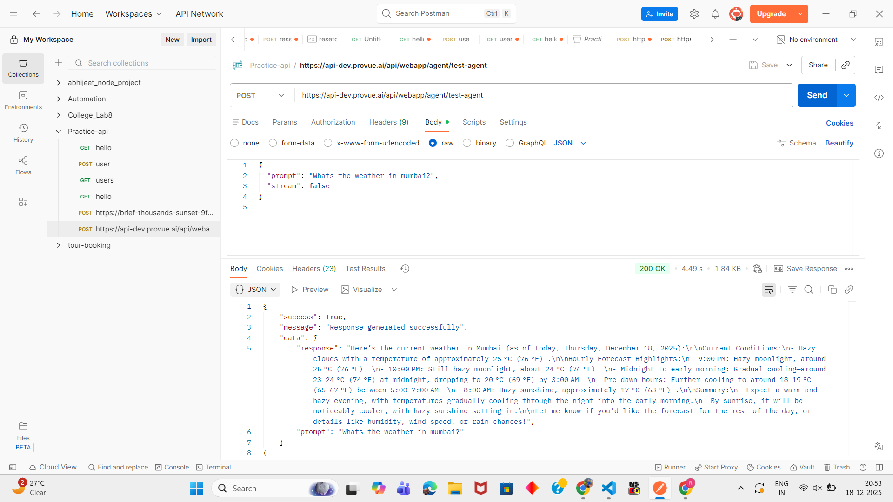

🌤️ Weather Agent Chat Interface

📌 Overview

This project is a responsive chat interface that allows users to interact with a Weather Agent through a streaming API.
The application focuses on clean UI, smooth user experience, persistent chat history, and robust error handling, following the specifications provided in the assignment.

### Demo Screeshots

### POSTMAN API TESTING

🚀 Features

*Core Functionality

Chat interface with message input and send button
User messages displayed on the right, agent responses on the left
Auto-scroll to latest message
Message timestamps
Suggested weather-related questions
Keyboard support (Enter to send)
API Integration
Integrated with Weather Agent streaming API
Loading / typing indicator during API calls
Disabled input while API request is in progress
Proper error handling with user-friendly messages

*Message Management

Conversation history stored in localStorage
Multiple chat threads supported
Chat history persists after page refresh
Ability to start a new chat
Ability to delete a chat (persistent deletion)

*UI / UX

Clean and modern UI
Responsive design (mobile, tablet, desktop)
Minimum width support: 320px
Distinct styling for user vs agent messages
Smooth scrolling and transitions
Dark / Light theme toggle (persistent)

🛠️ Tech Stack

React (Vite)
Tailwind CSS
JavaScript
Fetch API
localStorage (for persistent chat history)

📁 Project Structure

⚙️ Setup Instructions

1️⃣ Clone the Repository
git clone https://github.com/abhijeet1681/Pazago-weather-chat.git

cd pazago-weather-chat

2️⃣ Install Dependencies
npm install

3️⃣ Run the Application Locally
npm run dev

🌐 Deployment
The application is deployed using Vercel.

<a href="https://pazago-weather-chat-nu.vercel.app/"><strong>➥ Live Demo</strong></a>

🔑 API Configuration

The Weather Agent API is configured in:  src/services/weatherApi.js

🧠 Design Decisions

Used localStorage to persist chat history without backend dependency.

Auto-create a new chat when a user sends a message and no chat exists.

Disabled input during API calls to prevent duplicate requests.

Minimal UI changes to strictly follow the assignment design guidelines.

Dark mode implemented using Tailwind’s dark class for simplicity and performance.

🧪 Sample Test Scenarios

Ask: "What's the weather in Mumbai today?"

Refresh the page → chat history remains

Delete a chat → refresh → deleted chat does not reappear

Disconnect internet → error message is displayed

Switch to dark mode → refresh → preference persists

👤 Author

Full Name: Abhijeet Jadhav

Role: Frontend Engineer

📩 Submission Details

GitHub Repository: 

<a href="https://pazago-weather-chat-nu.vercel.app/"><strong>➥ Live Demo</strong></a>

This project fully satisfies the assignment requirements and focuses on usability, performance, and clean architecture.